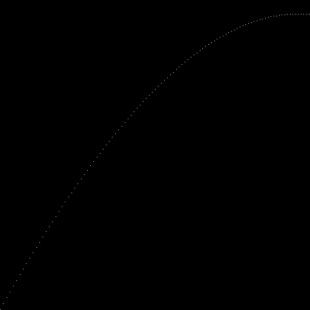
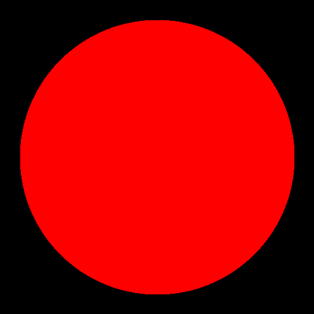
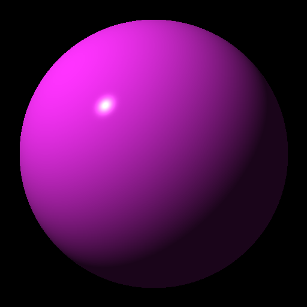
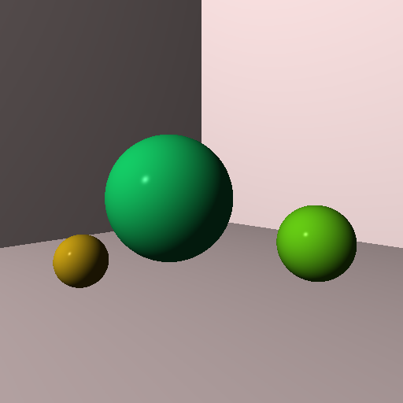
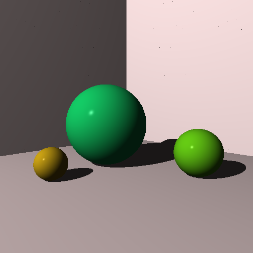
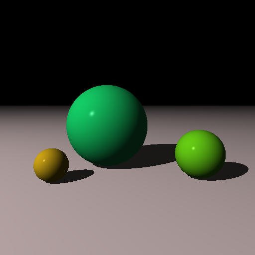
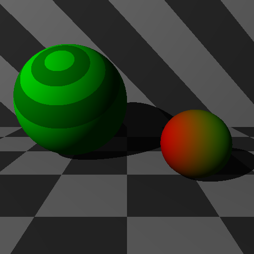

# Tracy

> A ray tracing renderer implemented in Rust as part of
> [The Ray Tracer Challenge](https://pragprog.com/titles/jbtracer/the-ray-tracer-challenge/).

## Rendered scenes

  
<strong>Chapter 2: Drawing on a Canvas</strong>

  

  
<strong>Chapter 4: Matrix Transformations</strong>

  

  
<strong>Chapter 5: Ray-Sphere Intersections</strong>

  

  
<strong>Chapter 6: Light and Shading</strong>

  

  
<strong>Chapter 7: Making a Scene</strong>

  

  
<strong>Chapter 8: Shadows</strong>

  

  
<strong>Chapter 9: Planes</strong>

  

  
<strong>Chapter 10: Patterns</strong>

  

